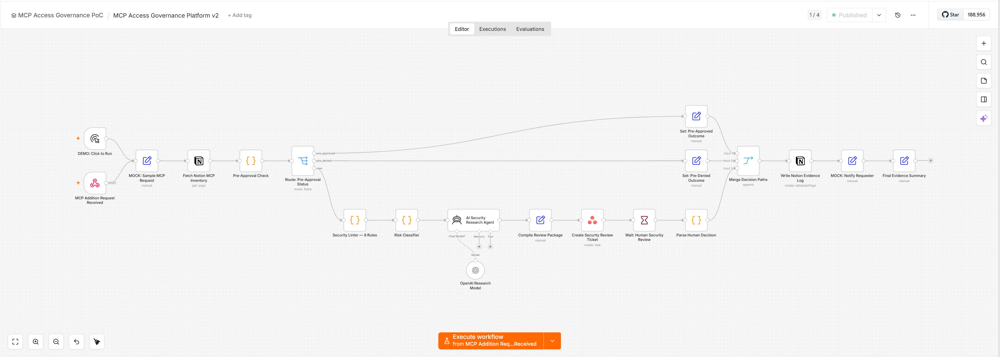

# MCP Access Governance Platform

> **A working proof of concept and enterprise-ready design pattern for governing AI agent and MCP-connected integrations before they become unmanaged risk.**

---

## The Risk Already in Your Environment

A backend developer connects a new MCP server to internal tooling. The server can read internal documents, query databases and call APIs on behalf of an AI agent.

The developer moves fast. Your security team does not know the integration exists until it is already in production.

This is the default outcome when AI-native development tools meet legacy access governance processes. It is happening now. At most organisations that have adopted AI-enabled workflows.

**What that exposure looks like:**

| Gap | Consequence |
|---|---|
| Shadow AI integrations | Agents connect to internal systems before any security review |
| No documented ownership | No accountable person for the AI workflow or its access |
| No audit trail | Nothing to produce if an incident or compliance review occurs |
| Inconsistent risk judgements | Each reviewer assesses differently, without a documented criteria |
| Privileged tool access without scope bounds | AI agents accumulate permissions that were never explicitly approved |

---

## The Working Solution



*The working n8n workflow: intake validation → risk classification → decision routing → human review queue → evidence capture*

---

## How It Works

Every AI agent integration, MCP server connection or external API access request flows through a structured intake and review process before reaching infrastructure.

```
Developer submits integration request (Asana)
              ↓
Validation — required fields checked, incomplete requests rejected
              ↓
Security linter — 9 deterministic policy rules applied automatically
              ↓
Risk classifier — Low / Medium / High / Prohibited
              ↓
       ┌──────┴──────────────────────────────────┐
       ↓                                          ↓
  Auto Allow                               Human Review
  (Low risk)                     (Medium / High — security team)
       ↓                                          ↓
  Evidence Record               Security Review Task (Asana)
                                                  ↓
                                       Reviewer Decision
                                  Approve / Conditional / Deny
                                                  ↓
                                       Evidence Record
```

Every path (approval, conditional approval or denial) produces a structured, durable evidence record.

---

## Control Objectives

Eight control objectives govern the platform. Each maps to workflow behaviour, not documentation intent:

| Control | Objective |
|---|---|
| **GOV-01** | Requests captured via structured intake with required fields. Incomplete requests are rejected before review |
| **GOV-02** | Risk classified using documented, deterministic criteria, consistent across all reviewers |
| **GOV-03** | Material risk routed to human review with a named reviewer. No automated approval for high-risk access |
| **GOV-04** | Every terminal decision produces a structured audit evidence record |
| **GOV-05** | Approved access is time-bound and purpose-limited at the point of approval |
| **GOV-06** | No real provisioning occurs without explicit human sign-off |
| **GOV-07** | Workflow scope changes are governed by documented architecture boundaries |
| **GOV-08** | Approved access is flagged for re-review on material scope change |

---

## Risk Classification

Four-level model. Multiple co-occuring risk factors escalate the classification automatically.

| Level | Conditions | Decision Path |
|---|---|---|
| **Low** | Pre-approved service, read-only, public or internal data, valid owner, limited scope | Auto Allow |
| **Medium** | New service, limited sensitive data, new vendor, bounded privilege | Human Review |
| **High** | Confidential data, external AI service, MCP tool execution with side effects, production environment | Human Review, Security Team |
| **Prohibited** | Regulated data to unapproved service, broad write access without owner, uncontrolled agent execution | Auto Deny |

---

## Evidence Model

Every approved and denied request produces a structured JSON evidence record containing:

- Request identifier and submitting team
- Service name, type and access scope
- Risk classification and contributing factors
- Framework control tags (ISO 27001, ISO 42001, SOC 2, CSA AI)
- Decision outcome, reviewer identity and decision timestamp
- Approved scope limitations and review period

Evidence is written to GitHub (durable, versioned) and Notion (governance knowledge base). The record exists whether the request is approved or denied.

---

## Standards and Framework Alignment

| Standard | Application |
|---|---|
| **NIST SP 800-37** | Risk management structure: identify, assess, respond, monitor |
| **NIST SP 800-30** | Risk assessment language: likelihood, impact, risk level, treatment |
| **ISO/IEC 27001** | Access control (A.9), supplier risk (A.15), audit logging (A.12.4) |
| **ISO/IEC 42001** | AI governance: human oversight (8.4), accountability (5.3), AI risk planning (6) |
| **SOC 2 Type II** | Evidence of control operation over time, structured decision records |
| **CSA AI Controls Matrix** | Cloud AI governance, access control, data governance, auditability |
| **MAESTRO** | Agentic AI threat modelling: tool execution, orchestration, external integration layers |
| **OWASP LLM Top 10** | Prompt injection, excessive agency, sensitive data exposure, tool misuse |
| **MCP Security Guidance** | Consent, authorisation, tool scope, confused deputy protections |

> This project does not claim formal certification or attestation against any of these frameworks.

---

## Working PoC Stack

| Platform | Role |
|---|---|
| **n8n Cloud** | Workflow orchestration: validation, risk classification, decision routing, evidence generation |
| **Asana** | Intake form, human review task queue, remediation tracking |
| **Notion** | Governance knowledge base, MCP server inventory, decision records |
| **GitHub** | Source control, documentation, workflow exports, durable evidence artefacts |

### Enterprise Deployment Path

The PoC is designed to extend to enterprise infrastructure without architectural rework:

| Capability | Enterprise Target |
|---|---|
| Workflow hosting | Self-hosted n8n on GCP |
| Identity | Google Workspace |
| Secrets management | Google Secret Manager |
| Telemetry and logging | Google Cloud Logging |
| Security operations | Google Security Operations (SIEM) |
| Governance reporting | BigQuery |
| Access protection | GCP IAM + ZTNA overlay |

---

## Repository Structure

```
MCP_Governance_Platform/
├── README.md
├── docs/
│   ├── charter/
│   │   ├── 01-executive-landing.md          ← Business problem and governance model
│   │   └── 02-project-charter.md            ← Full project charter with scope and controls
│   ├── solution-design/
│   │   └── 03-solution-design.md            ← Architecture, components and data flow
│   ├── security-architecture/
│   │   └── 04-security-architecture.md      ← Trust model, threat surface and defence controls
│   ├── n8n-implementation/
│   │   └── 05-n8n-implementation-guide.md   ← Workflow import, credential and test guide
│   ├── governance/
│   │   ├── 06-risk-classification-matrix.md ← Full scoring model
│   │   ├── 07-decision-logic-matrix.md       ← Auto allow / review / deny rules
│   │   └── 08-governance-control-register.md ← Control objectives and framework mapping
│   └── evidence/
│       ├── 09-evidence-model.md              ← What evidence is captured and what it proves
│       ├── 10-security-review-checklist.md
│       ├── 11-demo-script.md
│       └── 12-technical-case-study.md
├── workflows/
│   └── n8n/
│       └── mcp_access_governance_poc_v0.json ← Importable n8n workflow
├── examples/
│   ├── payloads/                              ← Sample request payloads
│   └── findings/                             ← Sample linter outputs and evidence records
└── schemas/                                  ← JSON schemas for intake and evidence
```

---

## Reading Guide

| Starting point | Where to go |
|---|---|
| Business problem and governance model | [Executive Landing Page](docs/charter/01-executive-landing.md) |
| Full project charter with scope and controls | [Project Charter](docs/charter/02-project-charter.md) |
| Control objectives and framework mapping | [Governance Control Register](docs/governance/08-governance-control-register.md) |
| Evidence design and what each record proves | [Evidence Model](docs/evidence/09-evidence-model.md) |
| Architecture and component model | [Solution Design](docs/solution-design/03-solution-design.md) |
| Security trust model and threat surface | [Security Architecture](docs/security-architecture/04-security-architecture.md) |
| Risk scoring logic | [Risk Classification Matrix](docs/governance/06-risk-classification-matrix.md) |
| Decision rules | [Decision Logic Matrix](docs/governance/07-decision-logic-matrix.md) |
| Import and run the workflow | [n8n Implementation Guide](docs/n8n-implementation/05-n8n-implementation-guide.md) |

---

## Running the PoC

1. Import [`workflows/n8n/mcp_access_governance_poc_v0.json`](workflows/n8n/mcp_access_governance_poc_v0.json) into n8n
2. Configure Asana and Notion credentials, see [n8n Implementation Guide](docs/n8n-implementation/05-n8n-implementation-guide.md)
3. Run a test using the [Demo Script](docs/evidence/11-demo-script.md) with sample payloads in [`examples/payloads/`](examples/payloads/)
4. Review the evidence output against the [Evidence Model](docs/evidence/09-evidence-model.md)

---

## Data Safety

All sample data in this repository is fictional. This repository contains no API keys, OAuth tokens, real customer data, personal information, production credentials or live deployment configuration.

Workflow exports have been reviewed to confirm all credential references are fictional placeholders.

---

> This project demonstrates a working proof of concept and an enterprise-ready design pattern. It is not a production deployment, a formal certification or a complete enterprise control environment.
